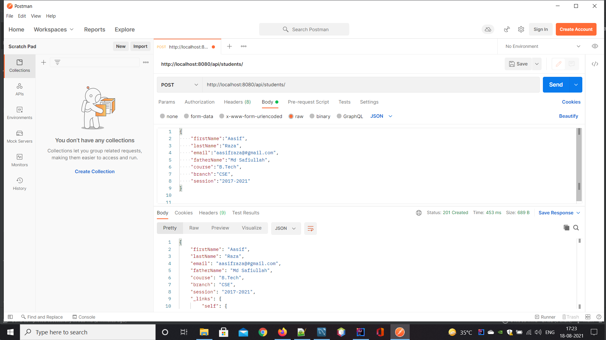
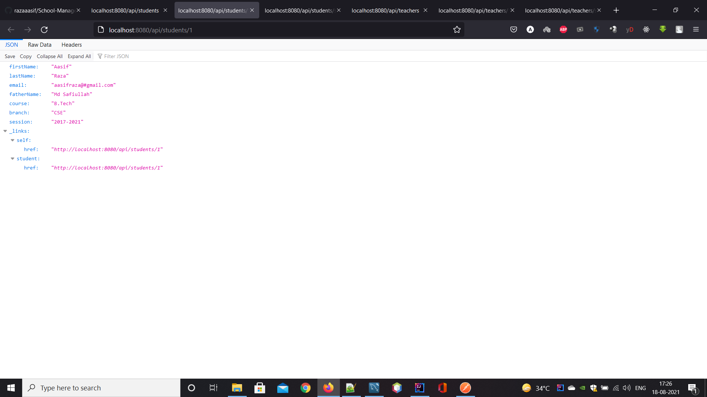
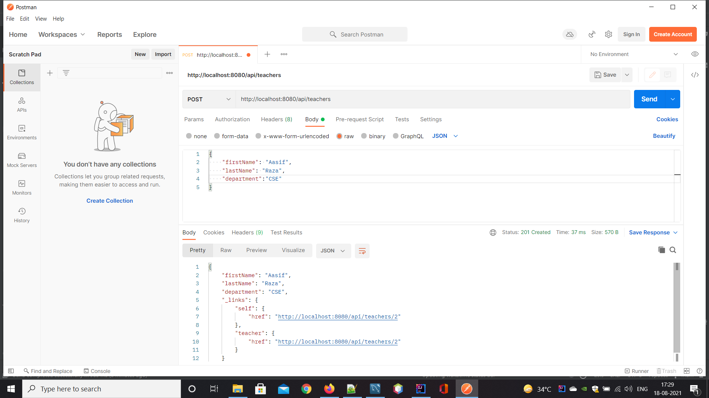
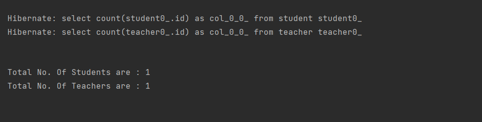
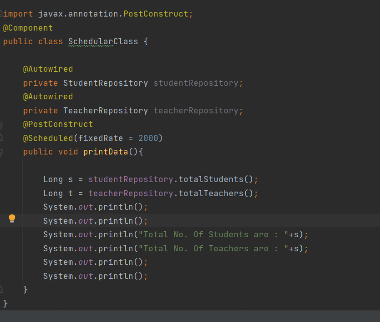

# School-Management-System
A  School-Management-System Rest api.

Rest Endpoints are :

              Student
## 1.  http://localhost:8080/api/students

## 2. http://localhost:8080/api/students/1

3. http://localhost:8080/api/students/search/totalStudents
              
              Teacher
## 4. http://localhost:8080/api/teachers

## Total number of students and Teacher is given Schedualr method 
## in by every 200 ms

